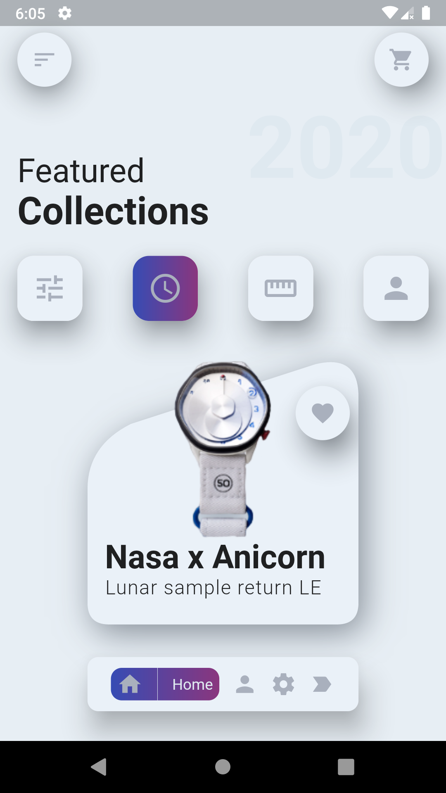

<h1><b>Practice with CustomClipper</b></h1>

This is a little flutter practice working with CustomClipper to give my designs a custom shape, i did this practice based on a random design that I found on pinterest. Please feel free to clone this repository and use it in your projects however you like.

## Getting Started

This project is a starting point for a Flutter application.

A few resources to get you started if this is your first Flutter project:

- [Lab: Write your first Flutter app](https://flutter.dev/docs/get-started/codelab)
- [Cookbook: Useful Flutter samples](https://flutter.dev/docs/cookbook)

For help getting started with Flutter, view our
[online documentation](https://flutter.dev/docs), which offers tutorials,
samples, guidance on mobile development, and a full API reference.
